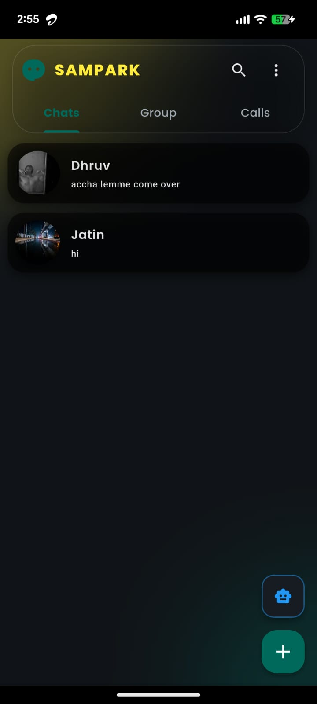
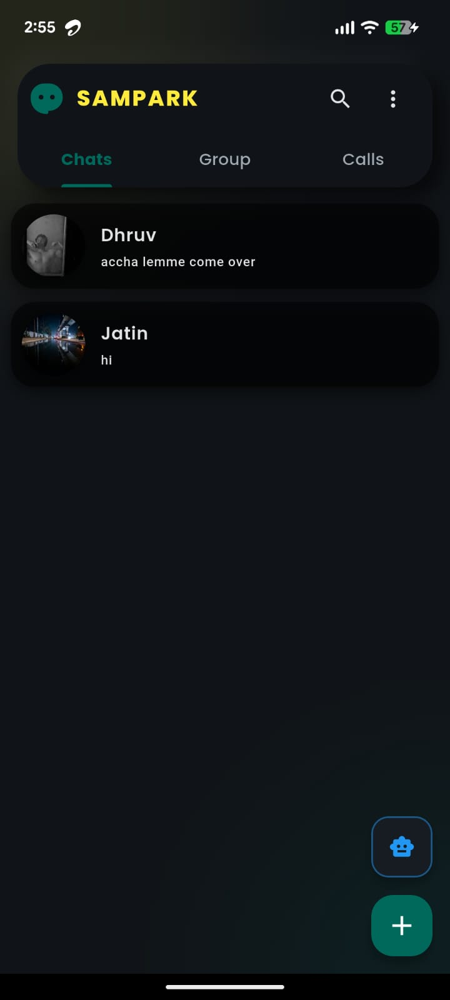
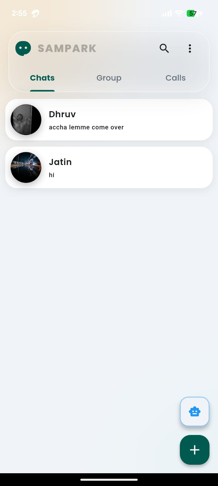
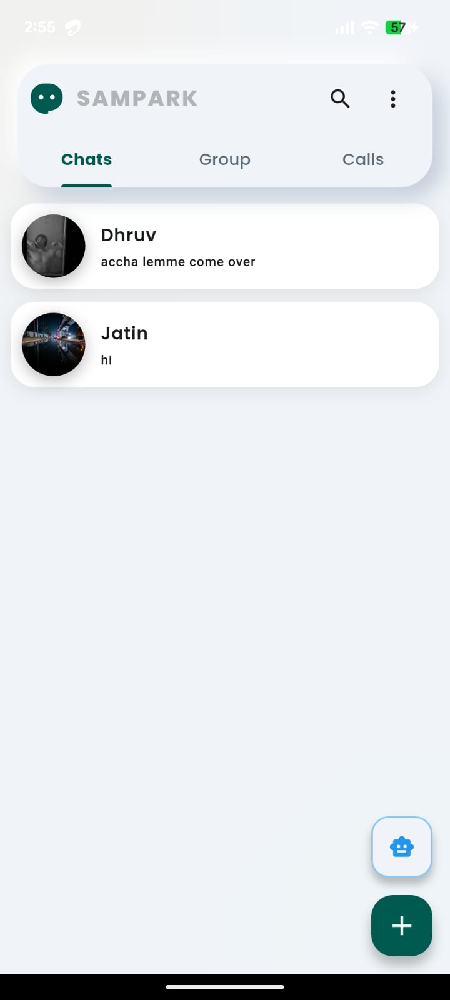
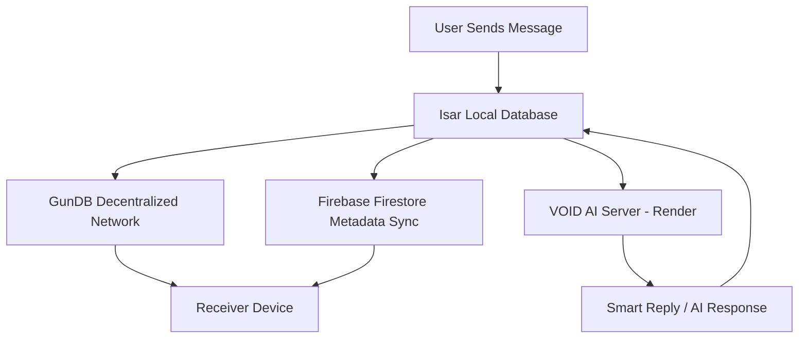

# SAMPARK  
> Next-Generation, Decentralized, AI-Powered Communication.

  
  
  

<!-- TODO: Replace badge links and targets with real ones -->

---

Download (Google Drive):  
[Download SAMPARK (Google Drive)](link-to-gdrive-file)

<!-- TODO: Replace hero banner and Google Drive link with actual assets -->

---

## Introduction & Features

SAMPARK is an offline-first, highly secure chat application built with Flutter, designed for a future where privacy, decentralization, and intelligence are first-class citizens. At its core lives the integrated AI assistant V.O.I.D. SYSTEM, helping you generate smart replies, automate tasks, and answer queries directly inside your conversations.

### Core Features

- Offline-first messaging with local read/write and seamless sync when connectivity is available.  
- OTP phone authentication for secure and frictionless onboarding using phone-number-based OTP verification.  
- Real-time presence and typing indicators to know when your contacts are online, viewing, and typing.  
- V.O.I.D. SYSTEM (AI assistant) for smart reply generation, summarizing long conversations, and answering questions inside the chat.  
- Smart replies in the composer, with context-aware suggestions surfaced right above the input box for one-tap sending.  
- Media sharing via Cloudinary with optimized image and media uploads using Cloudinary’s global CDN.  
- Resilient offline sync where messages are always written locally first and then synced to the cloud and mesh network.  
- Multi-theme, multi-mode UI engine using a 2×2 matrix of visual styles powered by ambient architecture.

---

## UI/UX Gallery

SAMPARK ships with a 2×2 design matrix, combining themes and design modes to give users four distinct visual experiences.

### Themes

- Light Theme – “Soft Nature”  
  - Palette: Alabaster backgrounds with Sage accents.  
  - Mood: Calm, breathable, and minimal for daylight usage.

- Dark Theme – “Deep Atmosphere”  
  - Palette: Obsidian surfaces with Amber highlights.  
  - Mood: Cinematic, ambient, and focused, featuring breathing orbs that subtly animate in the background.

### Design Modes

- Glassmorphism  
  - Frosted glass panels with deep blurs.  
  - Translucent layers floating above ambient, moving background orbs.  
  - Ideal for users who love futuristic, parallax-like depth.

- Neomorphism  
  - Soft, extruded surfaces matching the background color.  
  - Dual inner and outer shadows to create tactile, touchable components.  
  - Suitable for users who prefer subtle depth and a skeuomorphic feel.

  
  
  
  

---

## Architecture & Tri-Layer Data Flow

SAMPARK is engineered around a tri-layer data architecture that cleanly separates local performance, cloud metadata, and decentralized message payloads for maximum privacy and resilience.

### Layer 1: Local Cache (Isar Database)

All messages are written to Isar locally first, before any network operation.

- Blazing-fast reads and writes thanks to Isar’s native, binary storage.  
- Offline-capable, as the entire conversation history remains accessible even with no connectivity.  
- Eventual consistency, where message states are reconciled with Firestore and GunDB on reconnect.

### Layer 2: Cloud Sync (Firebase Firestore)

Firebase Firestore acts as the metadata and coordination layer.

- User metadata such as profiles, avatars, and basic identity.  
- Presence and typing indicators for real-time online status, last seen, and typing signals.  
- Chat room states including membership, read receipts, and lightweight room configuration.  

Firestore provides strong-enough consistency and real-time updates, enabling responsive UX without holding the actual message bodies.

### Layer 3: Decentralized Vault (GunDB)

This is the heart of SAMPARK’s privacy story.

- Encrypted message payloads are routed through GunDB, a decentralized peer-to-peer database network.  
- No central server holds the master copy of user conversations.  
- Peer-to-peer mesh where nodes distribute and replicate messages across the mesh, increasing resilience and reducing central points of failure.  
- Enhanced privacy because even if coordinating infrastructure is compromised, the actual content remains encrypted and distributed rather than centrally stored.

In summary: Isar guarantees speed and offline access, Firestore orchestrates sessions and presence, and GunDB protects conversations in a decentralized vault.

---

## Data Flow Diagram (Mermaid)

The following diagram represents how a message flows through SAMPARK’s tri-layer architecture, including the path to the V.O.I.D. SYSTEM AI server (hosted on Render) for smart replies.

---

## Installation / Getting Started

Follow these steps to get SAMPARK running locally.

### 1. Prerequisites

- Flutter SDK (3.x or newer) installed and added to your PATH.  
- Android Studio or Xcode configured for device or emulator deployment.  
- A Firebase project with:
  - Firebase Authentication (Phone or OTP) enabled  
  - Cloud Firestore enabled  
- A Cloudinary account for media hosting.  
- A V.O.I.D. SYSTEM backend (Node.js service deployed on Render or equivalent) with an accessible HTTP endpoint.

### 2. Clone the Repository

From your terminal:

- `git clone https://github.com/DhruvChaurasia9403/Talko.git`  
- `cd Talko`

You can rename the folder or repository branding to SAMPARK as desired.

### 3. Install Dependencies

Run Flutter’s package resolution:

- `flutter pub get`

### 4. Firebase Configuration

1. Create Android and iOS apps in your Firebase project.  
2. Download and add:  
   - `google-services.json` to `android/app/`  
   - `GoogleService-Info.plist` to `ios/Runner/`  
3. If you are using the `flutterfire` CLI, generate and update `firebase_options.dart` and ensure it is initialized in your `main.dart`.

### 5. Configure Cloudinary

1. In your Cloudinary dashboard, create an API key and secret.  
2. Expose them to the Flutter app using your chosen configuration strategy, for example:
   - Environment variables injected at build time, or  
   - A secure config file (never commit secrets to version control).  
3. Update the Cloudinary base URL and presets where media uploads are handled in the codebase.

### 6. Configure V.O.I.D. SYSTEM (AI Server)

1. Deploy your Node.js or compatible AI microservice to Render or any suitable host.  
2. Ensure you have an HTTPS endpoint for:
   - Generating smart replies  
   - Performing AI tasks requested from the client  
3. Add the AI endpoint base URL to your Flutter app’s configuration, such as a constants file or environment-specific config.

### 7. Run the App

- For Android: `flutter run -d android`  
- For iOS (on macOS): `flutter run -d ios`  

Optionally, use Flutter flavors or different Firebase projects for development, staging, and production to mirror your deployment strategy.

---

## Tech Stack

SAMPARK leverages a tightly integrated, modern stack focused on performance, offline resilience, and privacy.

- Flutter – Cross-platform UI toolkit for Android and iOS.  
- Dart – Primary application language.  
- GetX or similar – State management, routing, and dependency injection.  
- Isar Database – Local, high-performance NoSQL database for offline caching.  
- Firebase Authentication – Phone-number-based OTP login.  
- Firebase Firestore – Real-time metadata, presence, typing indicators, and room state management.  
- GunDB – Decentralized, peer-to-peer database network for encrypted message payloads.  
- Cloudinary – Media storage, transformation, and global CDN delivery.  
- V.O.I.D. SYSTEM (AI backend) – Node.js or similar service, typically deployed on Render, orchestrating AI features and smart replies.  
- Optional CI/CD and tooling – GitHub Actions or equivalent for automated builds, tests, and deployments.
